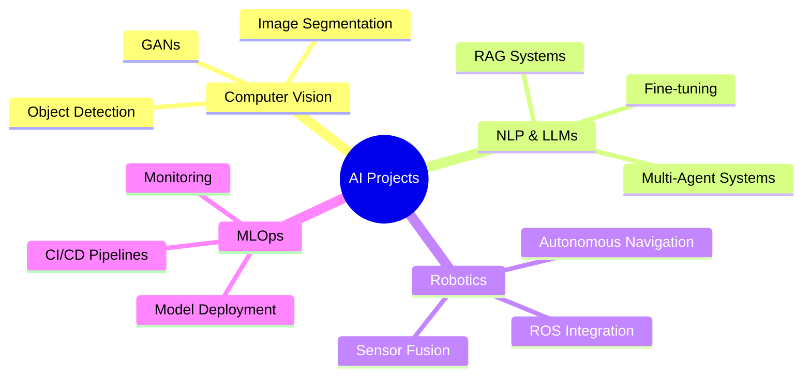

# Hi there, I'm Mohammed Zaloom 👋

<div align="center">
  
### 🤖 AI Technologist | 🧠 Machine Learning Engineer | 🚀 Innovation Enthusiast

*"Teaching machines to think, robots to move, and neural networks to dream."*

[](https://linkedin.com)
[](mailto:)
[](https://portfolio.com)

</div>

---

## 🎯 About Me

Passionate AI Technologist specializing in **Deep Learning**, **Computer Vision**, and **Natural Language Processing**. I build intelligent systems that bridge the gap between research and real-world applications, from autonomous robots to production-ready AI solutions.

```python
class MohammedZaloom:
    def __init__(self):
        self.role = "AI Technologist"
        self.location = "Amman, Jordan"
        self.education = "AI & Robotics"
        self.currently_learning = ["MLOps", "LLM Fine-tuning", "Multi-Agent Systems"]
        self.interests = ["Generative AI", "Computer Vision", "Robotics", "NLP"]
    
    def get_tech_stack(self):
        return {
            "deep_learning": ["PyTorch", "TensorFlow", "Keras", "Vision Transformers", "GANs"],
            "computer_vision": ["OpenCV", "YOLO", "Object Detection", "Image Segmentation"],
            "nlp": ["LLMs", "VLMs", "RAG", "Transformers", "HuggingFace"],
            "robotics": ["ROS", "Arduino", "Autonomous Navigation", "Sensor Fusion"],
            "deployment": ["Docker", "AWS", "Azure", "Flask", "FastAPI"],
            "data_science": ["Pandas", "NumPy", "Scikit-learn", "Matplotlib", "Seaborn"]
        }
    
    def current_focus(self):
        return "Building production-ready AI systems with LLMs and Computer Vision"
```

---

## 🛠️ Tech Stack

<div align="center">

### 🔥 Core Technologies


### 📊 Data Science & ML


### 🤗 AI & LLMs


### ☁️ Deployment & DevOps


### 🤖 Robotics & IoT


</div>

---

## 📊 GitHub Analytics

<div align="center">
  


</div>

---

## 🏆 Certifications & Achievements

<div align="center">

| 🎓 Certification | 🏢 Provider |
|:-----------------|:------------|
| Deep Learning Specialization | DeepLearning.AI |
| NLP Specialization | DeepLearning.AI |
| TensorFlow Developer Specialization | Google |
| MLOps Specialization | DeepLearning.AI |
| Generative AI with LLMs | DeepLearning.AI |
| AI Agents and MCP | Advanced AI |
| AWS AI Practitioner | Amazon Web Services |
| IoT Programming Specialization | UC Irvine |

</div>

---

## 🎯 Current Focus



---

## 💡 Featured Projects

> 🚧 Check out my pinned repositories below for exciting AI projects!

---

## 📫 Let's Connect!

<div align="center">

I'm always excited to collaborate on innovative AI projects and discuss the latest developments in machine learning and robotics!

**Feel free to reach out:**

[](https://linkedin.com)
[](mailto:)
[](https://portfolio.com)

---

*⭐️ From [mozaloom](https://github.com/mozaloom) with passion for AI*

</div>
