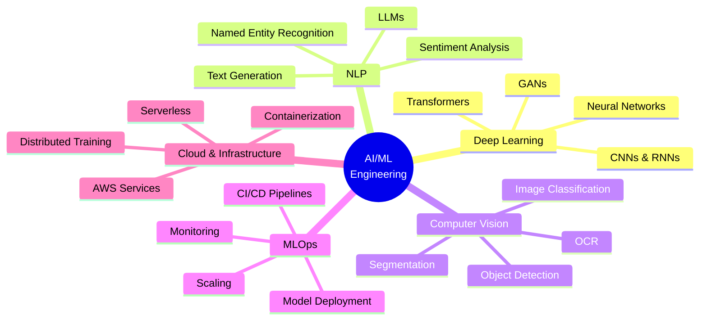

<div align="center">

<!-- Hero Banner -->


<!-- Animated Typing -->


<br/>

<!-- Profile Views Counter -->


</div>

---

## 🚀 About Me

```yaml
name: Mahmoud AbuAwd
role: AI/ML Engineer
location: 🇯🇴 Jordan
company: Founder @ MedGAN
focus: Human-Aligned Intelligence Systems
philosophy: "Fine-tuning possibilities, not just models"

current_work:
  - Developing Agentic AI solutions
  - Building production-ready ML systems
  - Bridging research and real-world impact
  
interests: [Deep Learning, NLP, Computer Vision, MLOps, Generative AI]
```

> 💡 **Mission:** Designing AI systems that learn, adapt, and spark innovation—bridging the gap between cutting-edge research and transformative real-world applications.

---

## 🎯 What I Do

<div align="center">

| 🧠 **AI/ML Engineering** | 🔬 **Research to Production** | 🚀 **Startup Innovation** |
|:-------------------------|:------------------------------|:--------------------------|
| Building intelligent systems that solve real problems | Translating papers into scalable code | Founding MedGAN for AI solutions |
| Designing human-aligned AI | Creating inference APIs | Leading Agentic AI development |
| Fine-tuning & optimization | MLOps & deployment pipelines | Driving technical vision |

</div>

---

## 🏆 Certifications & Achievements

<div align="center">

| 🎖️ Certification | 🏢 Organization | 📅 Year | 🎯 Status |
|:-----------------|:----------------|:--------|:----------|
| 🎓 **AWS Certified AI Practitioner** | Amazon Web Services | 2025 | ✅ Active |
| 🤖 **TensorFlow Developer Certificate** | DeepLearning.AI | 2024 | ✅ Active |
| 🧠 **Deep Learning Specialization** | DeepLearning.AI | 2024 | ✅ Active |
| 📊 **Machine Learning & Data Science** | The Hope | 2024 | ✅ Active |
| 📈 **Power BI for Data Analysis** | Microsoft | 2024 | ✅ Active |
| ☁️ **AWS AI Full Stack** | Manara | 2024 | ✅ Active |
| 🎯 **AWS Certified ML – Specialty** | Amazon Web Services | 2025 | 🔄 In Progress |

</div>

---

## 💻 Tech Stack & Skills

<div align="center">

### **Languages & Frameworks**


### **Cloud & MLOps**


### **Data & Databases**


### **Tools & Platforms**


</div>

---

## 📊 GitHub Analytics

<div align="center">


<!-- Activity Graph -->


</div>

---

## 🎯 Core Expertise

<div align="center">



</div>

---

## 🌟 Skill Proficiency

<div align="center">

| 🛠️ **Domain** | 📊 **Proficiency** | 🎯 **Level** |
|:--------------|:-------------------|:-------------|
| 🧠 **AI/ML** |  | Expert |
| 🐍 **Python** |  | Expert |
| 💬 **NLP** |  | Expert |
| ☁️ **Cloud (AWS)** |  | Expert |
| 📊 **MLOps** |  | Advanced |
| 👁️ **Computer Vision** |  | Advanced |
| 🔥 **TensorFlow/PyTorch** |  | Advanced |
| 🗄️ **Data Engineering** |  | Advanced |
| 🚀 **DevOps** |  | Advanced |
| 🌐 **Web Development** |  | Intermediate |

</div>

---

## 🏅 GitHub Trophies

<div align="center">


</div>

---

## 💼 Featured Projects

<div align="center">

<!-- Add your actual projects here -->
[](https://github.com/mahmoudabuawd)

</div>

---

## 🤝 Let's Connect & Collaborate

<div align="center">

### 💬 Always open to interesting projects and collaborations!

[](https://www.linkedin.com/in/mahmoud-abuawd-247290225/)
[](mailto:mahmoodabuawad08@gmail.com)
[](https://mahmoud3wd.netlify.app)

<br/>

### 📬 **Open for:**
🚀 AI/ML Consulting • 🤝 Collaborations • 💼 Freelance Projects • 🎓 Mentorship • 💡 Innovation Partnerships

<br/>

<!-- Quote -->


</div>

---

<div align="center">

### 🌟 *"Building tomorrow's intelligence, one model at a time"* 🌟


**⭐ If you find my work interesting, consider giving a star to my repositories! ⭐**

<!-- Footer Wave -->


</div>
