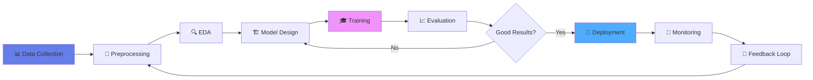
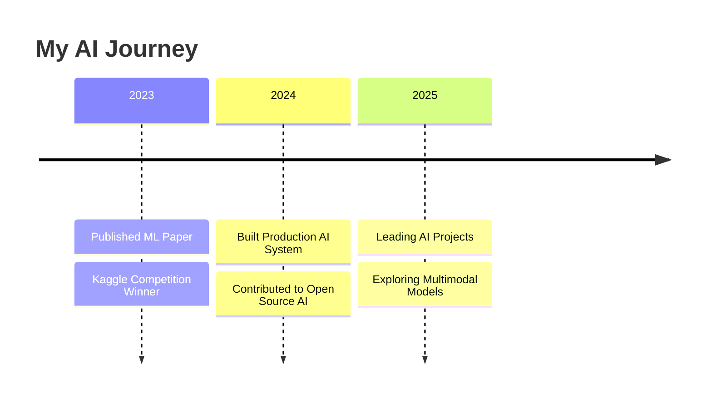

# Hi there! 👋 I'm [Your Name]

<div align="center">
  


</div>

## 🤖 About Me

I'm passionate about artificial intelligence and building systems that learn, adapt, and solve complex problems. From neural networks to LLMs, I explore the cutting edge of AI technology.

```python
class AIEngineer:
    def __init__(self):
        self.name = "Your Name"
        self.role = "AI/ML Engineer"
        self.interests = ["Deep Learning", "NLP", "Computer Vision", "LLMs"]
        self.current_focus = "Building AI-powered applications"
    
    def say_hi(self):
        print("Thanks for dropping by! Let's build something intelligent together.")

me = AIEngineer()
me.say_hi()
```

## 🧠 AI/ML Tech Stack

### **Core Frameworks & Libraries**

<p align="center">
  
  
  
  
  
</p>

### **Data Science & Analysis**

<p align="center">
  
  
  
  
</p>

### **Languages & Tools**

<p align="center">
  
  
  
  
</p>

### **Cloud & MLOps**

<p align="center">
  
  
  
  
</p>

## 🎯 AI Workflow



## 📊 GitHub Stats

<div align="center">
  
  
</div>

<div align="center">
  
</div>

## 🔥 Featured Projects

### 🤖 [Project Name 1](link-to-repo)
> Advanced NLP model for sentiment analysis with BERT fine-tuning
- **Tech**: PyTorch, Transformers, BERT
- **Accuracy**: 94.5%
- ⭐ 100+ stars

### 🖼️ [Project Name 2](link-to-repo)
> Computer vision system for object detection in real-time
- **Tech**: TensorFlow, YOLO, OpenCV
- **Performance**: 30 FPS on edge devices
- ⭐ 75+ stars

### 💬 [Project Name 3](link-to-repo)
> Custom LLM chatbot with RAG architecture
- **Tech**: LangChain, OpenAI API, ChromaDB
- **Features**: Context-aware responses
- ⭐ 50+ stars

## 🎓 Recent AI Achievements



## 📚 Latest Blog Posts

<!-- BLOG-POST-LIST:START -->
- 🧠 Understanding Transformer Architecture from Scratch
- 🔥 Fine-tuning LLMs: A Practical Guide
- 📊 MLOps Best Practices for 2025
- 🎯 Building RAG Applications with LangChain
<!-- BLOG-POST-LIST:END -->

## 🌐 Connect With Me

<p align="center">
  <a href="https://linkedin.com/in/yourprofile"></a>
  <a href="https://twitter.com/yourhandle"></a>
  <a href="mailto:your.email@example.com"></a>
  <a href="https://yourportfolio.com"></a>
</p>

## 💡 Fun Fact

```python
while True:
    learn_new_ai_technique()
    build_something_cool()
    share_knowledge()
    # Repeat forever! 🚀
```

---

<div align="center">
  


**"The question isn't whether AI will change the future, but how we'll shape it."**

⭐ From [Your Name](https://github.com/YOUR_USERNAME)

</div>
